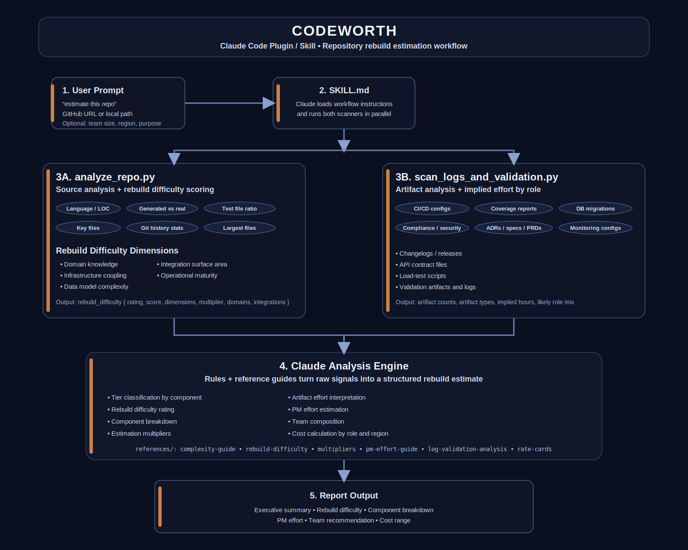

# Codeworth

AI-powered repository valuation and rebuild-effort estimation for technical diligence, rewrite scoping, and engineering cost analysis.

Codeworth is a Claude skill/plugin that analyzes a software repository and estimates the human time, team composition, and cost required to rebuild it from scratch.

Unlike naive estimators that rely on lines of code alone, Codeworth evaluates the hidden drivers of engineering effort: architecture, domain complexity, integrations, delivery artifacts, operational maturity, and product overhead.

---

## Why this exists

Most repositories are judged badly.

People look at LOC, frameworks, or a quick skim of the folder tree and pretend they understand replacement cost. They usually don’t.

A small codebase can encode months of specialized security research, ugly integration workarounds, or domain knowledge that took real product and engineering effort to uncover.

Codeworth exists to answer a more useful question:

**What would it actually take to rebuild this repo properly?**

That makes it useful for:

- Technical diligence before an acquisition or investment
- Rewrite scoping before committing to a rebuild
- Freelance / consulting estimation for complex repos
- Engineering leadership communicating replacement cost in business terms
- AI PM portfolio review when assessing the substance of technical work

---
## Architecture

Codeworth runs two parallel scanners—source analysis and artifact analysis—then uses Claude plus reference guides to produce a rebuild-effort and cost estimate.
---

## What makes Codeworth different

Rebuild cost is driven by hidden complexity, not just code volume.

Codeworth evaluates rebuild difficulty across five dimensions:

### 1. Domain Knowledge
Specialized domains like payments, healthcare, cryptography, robotics, distributed systems, trading, tax, ML, or security.

### 2. Infrastructure Coupling
Kubernetes, Terraform, Helm, service mesh, data platforms, deployment pipelines, and operational glue.

### 3. Data Model Complexity
Schema depth, ORM model count, migration volume, and underlying state complexity.

### 4. Integration Surface Area
External APIs, enterprise systems, billing/auth providers, and custom system interfaces.

### 5. Operational Maturity
SLOs, runbooks, load tests, canary deploys, tracing, compliance artifacts, and production readiness signals.

The result is not just hours. It is a structured estimate with reasoning.

---

## What it produces

Running Codeworth generates a report containing:

- Executive summary with rebuild effort and cost range
- Repository overview and stack analysis
- Rebuild difficulty assessment
- Component breakdown by complexity tier
- Estimation adjustments for testing, docs, and coordination
- Artifact and validation analysis
- Product management effort estimate
- Recommended team composition
- Unified low / mid / high cost estimate
- Key complexity drivers and caveats

---

## Example insight

A repository can appear small but still have high rebuild cost because the real value lies in embedded knowledge.

For example, an Android security application may contain modest LOC but encode deep expertise around:

- Android Device Owner constraints
- profile isolation mechanics
- hidden API workarounds
- threat-model-driven UX
- coercion-resistant design
- validation workflows

These factors dramatically change rebuild effort.

---

## How it works

Codeworth combines two layers of analysis.

### Repository source analysis

The scanner inspects:

- language mix and LOC
- generated vs real code
- test coverage signals
- architecture files
- git-history patterns
- complexity indicators

### Artifact analysis

The artifact scanner detects:

- CI/CD configs
- migration history
- load test scripts
- ADRs and PRDs
- compliance documentation
- monitoring and observability configs

Claude then synthesizes these signals into a structured rebuild estimate.

---

## Estimation methodology

Workflow:

1. Analyze repository structure
2. Analyze validation and documentation artifacts
3. Classify components by complexity tier
4. Score rebuild difficulty across five dimensions
5. Decompose the system into engineering units
6. Apply multipliers for rework, testing, and coordination
7. Estimate PM effort where relevant
8. Recommend team composition
9. Convert hours to cost ranges

### Complexity tiers

- Tier 1 — Boilerplate
- Tier 2 — Standard
- Tier 3 — Complex
- Tier 4 — Specialized

### Difficulty ratings

- Low
- Moderate
- High
- Very High
- Extreme
- Exceptional

---

## Repository structure

codeworth/
├── .claude-plugin/
│   └── plugin.json
├── SKILL.md
├── README.md
├── LICENSE
├── evals/
│   └── evals.json
├── references/
│   ├── complexity-guide.md
│   ├── rate-cards.md
│   ├── multipliers.md
│   ├── pm-effort-guide.md
│   ├── log-validation-analysis.md
│   └── rebuild-difficulty.md
└── scripts/
    ├── analyze_repo.py
    └── scan_logs_and_validation.py

---

## Installation

Clone locally:

git clone https://github.com/teterouge/codeworth.git
cd codeworth

Then add the skill to your Claude environment using your preferred plugin workflow.

---

## Usage

Example prompts:

Estimate this repo

Estimate the cost to rebuild this repo from scratch: /path/to/repo

Estimate this GitHub repository for acquisition diligence: github.com/org/repo

Providing context such as team size, region, and purpose will improve results.

---

## Built for AI PMs

This project demonstrates:

- AI workflow design
- architecture-aware estimation
- system decomposition
- heuristic modeling
- AI tooling productization

It is also useful for founders evaluating replacement cost or technical leverage.

---

## Limitations

Codeworth analyzes visible repository artifacts and cannot see:

- deleted code
- undocumented knowledge
- internal decision history
- private production incidents

It provides estimates, not formal quotes.

---

## Roadmap

Planned improvements:

- GitHub API enrichment
- contributor topology analysis
- repo comparison mode
- PDF/JSON export
- benchmark dataset vs human estimates
- expanded integration detection

---

## License

MIT
